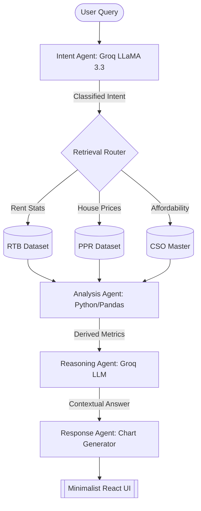
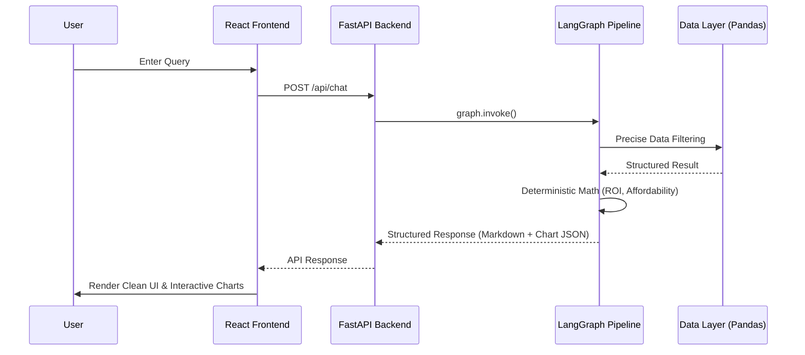

# IrishHome.AI: Agentic Structured-Data RAG for Irish Housing Intelligence

> **Official Research & Technical Documentation**  
> *IEEE-Style System Specification & Implementation Guide*

[](https://python.org)
[](https://fastapi.tiangolo.com)
[](https://groq.com)
[](https://langchain-ai.github.io/langgraph/)

---

## I. Abstract
IrishHome.AI is a production-grade, conversational intelligence platform designed to navigate the fragmented Irish property landscape. By employing an **Agentic Structured-Data Retrieval-Augmented Generation (RAG)** architecture, the system translates natural language queries into deterministic statistical insights. Unlike traditional LLM implementations prone to hallucination, IrishHome.AI grounds every response in real-time datasets from the RTB and CSO using a five-stage LangGraph orchestrated pipeline.

---

## II. System Architecture & Methodology

The system operates as a multi-agent state machine, separating intent classification, data retrieval, multi-dataset analysis, and reasoning into discrete, auditable nodes.

### A. Core Pipeline Flowchart (LangGraph)



### B. High-Level System Design



---

## III. Key Features & Capabilities

### 1. Multi-Agent Reasoning Pipeline
- **Intent Agent**: Uses strict JSON-mode classification to identify 7 distinct query categories (Rent, Buy, Compare, Trend, Affordability, Rec, Chat).
- **Reasoning Agent**: Provides context-aware explanations, including references to Irish-specific policy (RPZ zones, Help-to-Buy) without hallucinating hard figures.

### 2. Dynamic & Varied Visualizations
- **Intelligent Charting**: The system doesn't rely on fixed templates. It dynamically chooses between **Radar, Doughnut, PolarArea, Line, and Bar charts** based on the data structure.
- **Visual Diversity**: Identical queries results in randomized visualization styles to provide a fresh, organic user experience.

### 3. Comprehensive Data Grounding
- **RTB Integration**: Real-time rental indices across all 26 counties.
- **PPR Analytics**: Dublin property price register analysis.
- **CSO Affordability**: Income-to-rent ratio calculations (the 30% rule) using official earnings data.

### 4. Minimalist "Claude-Style" UI
- **Zero-Clutter Design**: Refined, typography-driven interface with centered chat columns.
- **Dual-Theme Support**: Native Dark/Light mode switching with an elegant, responsive layout.

---

## IV. Technical Specification (IEEE Format Summary)

| Specification | Implementation |
|---|---|
| **Architectural Model** | Agentic Structured-Data RAG |
| **Orchestration** | LangGraph (Stateful Dataflow) |
| **Language Model** | Groq LLaMA 3.3 70B Versatile |
| **Data Engine** | Pandas (Deterministic Retrieval) |
| **Frontend Framework** | React + Vite (Minimalist SPA) |
| **API Layer** | FastAPI + Uvicorn |
| **Visualization** | Chart.js / react-chartjs-2 |

---

## V. Extensibility & Plugin Architecture

The system is designed with a **Plugin-Ready Data Abstraction Layer**. The agent pipeline is decoupled from the data storage mechanism.

> [!TIP]
> To connect to a live PostgreSQL or external API, simply modify `backend/data_manager.py`. The LangGraph agents and Reasoning logic will remain 100% functional without modification.

---

## VI. Installation & Setup

### 1. Environment Configuration
Create a `.env` file in the root directory:
```bash
GROQ_API_KEY=gsk_your_key_here
```

### 2. Dependencies
```bash
# Backend
pip install -r requirements.txt

# Frontend (for development)
cd frontend && npm install
```

### 3. Execution
**Production (Unified Server):**
```bash
# Build the UI
cd frontend && npm run build
cd ../backend

# Start the application
python main.py
# Open: http://localhost:8000
```

---

## VII. Future Roadmap
1. **Streaming Tokens**: Implementing SSE for word-by-word response generation.
2. **Geospatial Mapping**: Leaflet.js integration for county-level heatmaps.
3. **Multi-Turn Memory**: Session-based context retention (GDPR compliant).

---

*© 2024 IrishHome.AI — Developed for the MSc in Artificial Intelligence, NCI.*
